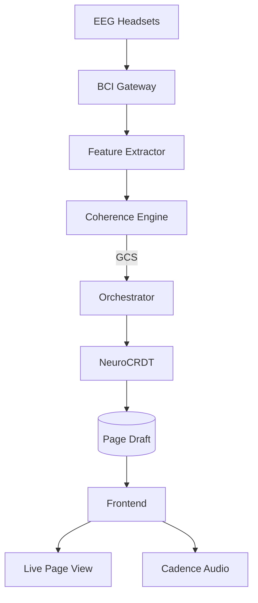

### 1 Preparing the Ground: “Convergence Chambers”

|Component|Function|Detail|
|---|---|---|
|**Timed Page Casting**|Emits the narrative at a calibrated rhythm (e.g., 90 BPM line‑break pulse) through subtle screen dimming and low‑volume binaural beats|Rhythm gives all readers a common _external pacer_, a prerequisite for neural entrainment ([nature.com](https://www.nature.com/articles/s41598-017-04464-4?utm_source=chatgpt.com "Brain-to-brain entrainment: EEG interbrain synchronization while ..."))|
|**Consumer EEG Gateway**|Accepts live streams from headsets such as Muse S v3, OpenBCI Galea, or the next‑gen optical wearables now in beta|WebSocket endpoint encrypts and down‑samples to 256 Hz to keep bandwidth light while preserving alpha/low‑beta bands|
|**Session Matching**|Groups 4 – 16 readers whose time‑zones overlap and whose baseline dominant frequencies sit within ±1 Hz|Smaller cohorts maximize phase‑locking likelihood per hyperscanning studies ([frontiersin.org](https://www.frontiersin.org/journals/human-neuroscience/articles/10.3389/fnhum.2020.00039/full?utm_source=chatgpt.com "Hyperscanning: A Valid Method to Study Neural Inter-brain ..."))|

A reader who opts in steps into a **Convergence Chamber**—a synchronized read‑along where text, ambient audio, and page‑turn animation all pulse in phase.

---

### 2 Detecting the Trance: The _Coherence Engine_

1. **Feature Extraction**  
    _Band‑pass filter_: 8 – 13 Hz (alpha) for relaxed focus; 30 – 45 Hz (gamma) for insight flashes.  
    _Phase‑Locking Value (PLV)_ computed pairwise across participants every 2 s.
    
2. **Group Coherence Score (GCS)**
    
    GCS(t)=1N(N−1)∑i≠jPLVij(t) \text{GCS}(t)=\frac{1}{N(N-1)}\sum_{i\neq j} \text{PLV}_{ij}(t)
    
    When **GCS > θ_entrain** (e.g., 0.65) for ≥ 5 s, the cohort is deemed in _shared liminal trance_. Inter‑brain synchrony at this level has been shown to predict collective task performance ([pmc.ncbi.nlm.nih.gov](https://pmc.ncbi.nlm.nih.gov/articles/PMC7812618/?utm_source=chatgpt.com "Inter-brain synchrony in teams predicts collective performance - PMC")).
    
3. **Privacy Layer**  
    Only GCS and band‑aggregate statistics ever leave the local edge node; raw EEG packets are discarded after the 10‑s window, satisfying forthcoming neuro‑data regulations ([vox.com](https://www.vox.com/future-perfect/400146/meta-brain-reading-neurotech-privacy?utm_source=chatgpt.com "Meta's brain-to-text tech is here. We are not remotely ready.")).
    

---

### 3 Translating Coherence into Story Edits

|Neuro‑Marker|Narrative Action|Rationale|
|---|---|---|
|**Alpha surge + low variance**|_Stabilise prose_: lock paragraph order, soften vocabulary shifts|Indicates relaxed consensus—readers are absorbing, not diverging|
|**Gamma micro‑burst (≥ 2 SD over baseline)**|_Branch fork_: surface an optional side plot or character viewpoint|Gamma bursts correlate with “aha” events; use them to birth new ideas|
|**Beta/Theta cross‑phase (frustration signal)**|_Temporal rewind_: briefly revert sentence to prior draft and seek alt phrasing|Allows the group to veto wording without typing|

A rule‑based **Neuro‑CRDT** applies the chosen operation. Because all edits are conflict‑free and timestamped, the live text updates simultaneously for the entire chamber.

---

### 4 Real‑Time Pipeline

- All nodes after the Gateway run inside a Kubernetes namespace dedicated to the session; pods autoscale with participant count.
    
- **Orchestrator** exposes a gRPC “neuro‑hook” so experimental models (e.g., DSPy agents) can replace rule‑logic with learned policies later.
    

---

### 5 Safeguards Against Noise & Dominance

- **Weighted Voting:** A participant whose headset quality drops below SNR_min is down‑weighted; prevents a single noisy feed from jerking the text.
    
- **Equity Clamp:** Max per‑reader influence ≤ 1 / N + σ; ensures no super‑user can dominate by wearing a multi‑sensor cap.
    
- **Fallback Grace:** If GCS falls beneath θ_sustain for 15 s, the system freezes edits and continues in normal read‑only mode until synchrony returns.
    

---

### 6 Ritual UI Cues

|Visual/Audio Element|Meaning|
|---|---|
|**Pulsing Border Glow**|Brightens in proportion to GCS; readers _feel_ collective coherence rising|
|**Tuning Fork Icon**|Appears when gamma burst triggers a branch; clicking reveals the freshly spawned paragraph in a split pane|
|**Low‑Chime Sweep**|Plays when Beta/Theta signal causes a soft rewind—psychologically frames it as an organic system breath, not an error|

---

### 7 Ethical & Experiential Considerations

1. **Cognitive Consent Contract** Introduces clear language: “Your aggregated brain‑state may influence live text. Raw data never persists.”
    
2. **Exit Hatch** Any reader can smash the _( )_ key to drop out instantly; upon exit their EEG weight decays to zero within 200 ms to prevent ghost influence.
    
3. **Fatigue Budget** System enforces a hard 45‑minute chamber cap, aligning with typical sustained‑attention limits reported in BCI literature ([frontiersin.org](https://www.frontiersin.org/journals/human-neuroscience/articles/10.3389/fnhum.2018.00014/full?utm_source=chatgpt.com "EEG-Based Brain–Computer Interfaces for Communication and ...")).
    

---

### 8 A Mini‑Scenario

_Ten readers join a Princhetta chapter. At the climactic riddle, GCS ramps to 0.72; a collective gamma spike fires. The Neuro‑CRDT spawns an italicised stanza revealing a hidden door. The border glow brightens; a soft harmonic overtone signals the group’s “discovery.” Moments later, one reader drifts—signal noise drops GCS to 0.60. Edits pause, the glow dims, the chamber breathes. The reader readjusts their headset; coherence returns and the story flows on._

---

### TL;DR

Gibsey can stage _Convergence Chambers_ where synchronized audiovisual pacing plus low‑cost EEG headsets allow real‑time **inter‑brain synchrony**. A Coherence Engine measures shared trance, and a Neuro‑CRDT converts specific neural signatures into live page edits. Privacy‑preserving aggregation, influence clamping, and short session windows avert ethical pitfalls, letting readers literally **think the story into being—together**.