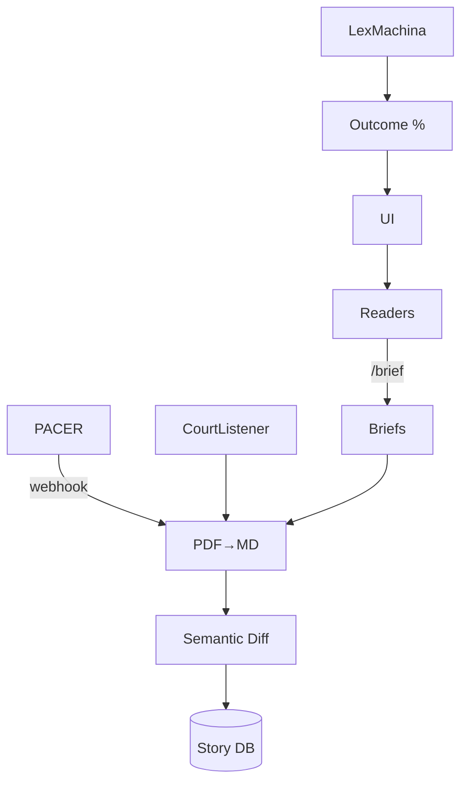

### 0 Premise in One Sentence

_The Author_ (diegetic writer‑god) sues _An Author_ (the “minor” mirror of that same self) for copyright infringement **inside** _The Entrance Way_, while Gibsey pipes the pleadings, dockets, and judicial analytics from live legal APIs (PACER, CourtListener, Lex Machina, etc.) straight into the prose—turning the book into an auto‑litigating metafiction.

---

## 1 Act Structure of the Recursive Lawsuit

|Act|Plot Beat|Technical Trigger|Recursive Twist|
|---|---|---|---|
|**I – Complaint**|_An Author_ files a DMCA‑style takedown mid‑chapter|`POST /us_courts/complaints` → PACER returns docket #|Filing itself is “new text,” which _The Author_ claims **He** owns, spawning Counter‑Complaint‑1|
|**II – Discovery**|Depositions occur in prose; witness exhibits include prior pages of the novel|Evidence corpus auto‑indexed in Cassandra, hashed to IPFS for chain‑of‑custody|Each exhibit is copyrighted → Counter‑Complaint‑2, 3, 4…|
|**III – Pre‑lim Injunction**|CourtListener API posts order enjoining further publication|Front‑end greys out pages under injunction|Injunction text is also new copyrighted work → further claims|
|**IV – Summary Judgment**|Lex Machina returns a 78 % probability _An Author_ wins|Narrative fork: users can follow **Predicted Path** or **Appeal Path**|Selecting a fork makes user a _necessary co‑author,_ adding them to lawsuit|
|**V – Settlement / Higher Appeal**|Parties propose co‑authorship token split|Smart contract drafts term sheet; NAT holders vote|If vote passes → story continues; if fails → writ of certiorari to _Supreme Court of Gibsey_ (launches Act VI)|

---

## 2 How the Real‑World Legal APIs Drive the Fiction

1. **Event Webhooks**  
    _Every_ new docket entry hits a Gibsey webhook → converts PDF text to Markdown → streams into the active chapter.
    
2. **Semantic Diff Engine**  
    The text delta between “pre‑API update” and “post‑API update” is treated as _new narrative material_ and thus potential infringement fodder—fueling the recursion.
    
3. **Predictive Analytics as Oracle**  
    Lex Machina’s outcome percentage is displayed in a sidebar.  
    _Characters_ start plotting strategy based on those numbers, which in turn alters litigation posture → numbers refresh → loop.
    
4. **Human Reader Inputs**  
    Readers can file _amicus briefs_ via a `/brief` endpoint. Briefs are appended to the docket **and** minted as μ‑gifts, giving them economic weight in future gift‑inflation calculus.
    

---

## 3 Emergent Storylines & Character Arcs

### 3.1 “Public Domain Storm”

A settlement proposes releasing all infringing text to the public domain at midnight. Princhetta must race to **capture** the text into the Gibsey Vault before the clock strikes, or it vanishes into negative curvature (the Hypernegative).

### 3.2 “Jurisdictional Collapse”

Recursive countersuits balloon until court load‑balancers (mirrored by Gibsey’s self‑sharding) route some claims to _fictional_ districts (e.g., the 12th Circuit of Narrative Equity). Real judges refuse to recognize these dockets, creating a constitutional crisis inside—and outside—the book.

### 3.3 “Token‑Strike”

NAT holders form a DAO called **The Barred Bar**; they escrow all agency tokens, starving both Authors of narrative control unless the lawsuit drops. This intersects plot point 8.2 (minor‑character unionisation), forming an inter‑guild coalition.

### 3.4 “Authorship Singularity”

Counter‑Complaint‑N hits the point where each sentence simultaneously belongs 50 % to _The Author_, 50 % to _An Author_, 50 % to the Court, and 10 % to every reader who has scrolled past it—a mathematically impossible allocation. The system resolves by triggering **Hypernegative escrow**: the surplus authorship “spills” into fifth‑dimensional negative space, birthing a new entity (cf. Question 1.1).

---

## 4 Mechanics of Recursion Control (Stopping Infinite Loops)

|Mechanism|Effect|
|---|---|
|**Litigation TTL**|Each claim decays after 8 narrative hours unless re‑asserted with new evidence.|
|**Quadratic Filing Fees**|CourtCharges smart contract charges fee²; serial claimants face exponential costs.|
|**Judicial Throttle**|A rate‑limit API key: only 1 docket push / 10 min; reduces text‑spam.|
|**Settlement Bounty**|μ‑Gift pool rewards the first proposal that both Authors sign + readers quorum‑approve.|

These keep the plot tense yet computationally tractable.

---

## 5 Legal‑Metafiction Themes Explored

1. **Self‑Reference & Gödelian Incompleteness**  
    The lawsuit resembles a Gödel sentence: “This text is unauthorised.” If the court agrees, the judgment is itself unauthorised, recursing.
    
2. **Real vs. Fictional Sovereignty**  
    When real APIs acknowledge fictional parties, they blur jurisdictional lines—echoing Question 7.4 on _truth embargoes_.
    
3. **Capital vs. Creativity**  
    NAT speculation distorts story value, echoing “gratitude inflation” controls (Question 5.1). Legal costs become sinkholes for μ‑gifts.
    
4. **Authorship as Collective hallucination**  
    Each reader filing an amicus brief literally writes themselves into the canon, fulfilling Gibsey’s gift‑economy premise.
    

---

## 6 Implementation Blueprint (MVP‑Level)

- Node.js microservice handles PACER/CourtListener ingestion (poll every 60 s).
    
- Python diff engine tags legalese `<blockquote class="docket">`; CSS styles it with gold bars.
    
- NAT voting dApp interfaces with Quad‑Voting contract; outcome writes back into `Vault`.
    

---

## 7 Endgame Variants

|Verdict|System Reaction|Narrative Resolution|
|---|---|---|
|**Co‑Authorship Granted**|All NATs convert to **CO‑NAT** (non‑transferable)|Story stabilises; lawsuit text becomes canonical appendix|
|**Dismissed with Prejudice**|APIs halt; recursion lock ends|Hypernegative “swallows” all pleadings—dark‑mirror Vault only|
|**Default Judgment**|One Author fails to respond; loses all agency tokens|Minor characters rebel, citing unjust enrichment → launches sequel arc|

---

### TL;DR

By wiring live legal APIs directly into the narrative fabric, the _recursive lawsuit_ becomes a plot engine: every motion breeds new text, which spawns fresh claims, looping until economic, temporal, or narrative guardrails force a resolution. Readers, NAT holders, and even real‑world judges co‑author the outcome, turning intellectual‑property law into both dramatic stakes **and** a distributed writing protocol—perfectly in line with Gibsey’s mandate to collapse the boundary between creation, collaboration, and consumption.